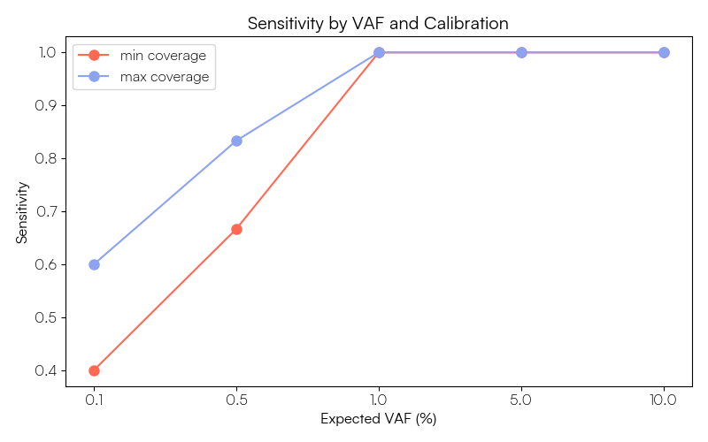
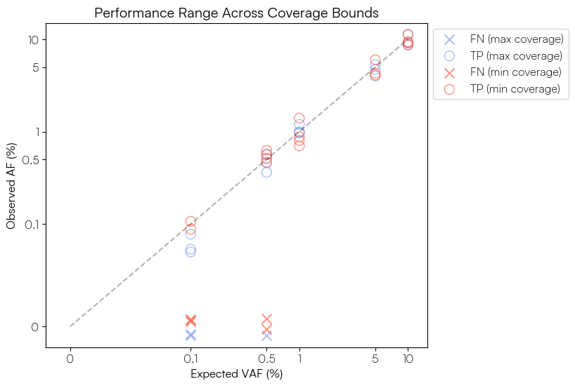

# ctDNA Sequins Tutorial

This is an example workflow for processing data from a cfDNA sample that has had the Sequins ctDNA Evaluation Set spiked in, enriched by hybrid-capture probes targeting both a human gene panel and the Sequins control regions, and sequenced using duplex Unique Molecular Indexes (UMIs). It highlights the points in the workflow where Sequins-specific steps must be applied in this context. It is not intended to represent a production workflow.

When performing your own analysis, you should adapt each step to the requirements of your data and study design. If your data do not incorporate UMIs or do not use targeted hybrid-capture panels, the corresponding UMI-handling and panel-specific components of this workflow should be omitted or replaced with methods appropriate to your sequencing strategy.

## Background

### Dependencies

This workflow uses a number of popular bioinformatics tools:

- Nextflow (https://github.com/nextflow-io/nextflow)
- GATK (<https://github.com/broadinstitute/gatk>)
- RTG tools (<https://github.com/RealTimeGenomics/rtg-tools>)
- samtools (<https://github.com/samtools/samtools>)
- bedtools (<https://github.com/arq5x/bedtools2>)
- bcftools (<https://github.com/samtools/bcftools>)
- Python (<https://github.com/python/cpython>)
  - NumPy (<https://github.com/numpy/numpy>)
  - Pandas (<https://github.com/pandas-dev/pandas>)
  - MatPlotLib (<https://github.com/matplotlib/matplotlib>)


`sequintools` is the only Sequins specific tool needed for the workflow. There
are multiple ways you can install it, see details at
<https://github.com/sequinsbio/sequintools>.

For conveneience, we provide a Docker container that has the above dependencies for analysis pre-installed, excluding `nextflow` for the consensus read creation. To run the nf-core/fastquorum pipeline for consensus read generation, please refer to the [nf-core/fastquorum documentation](https://nf-co.re/fastquorum/latest/) and [nextflow documentation](https://github.com/nextflow-io/nextflow).

You can download the latest version of the image with:

```sh
docker pull ghcr.io/sequinsbio/ctdna_tutorial:1.0.0
```

You can start the Docker container with:
```sh
docker run -it --rm -v "$PWD":"$PWD" -w "$PWD" -u "$(id -u)":"$(id -g)" \
  ghcr.io/sequinsbio/ctdna_tutorial:1.0.0
```

### Sequins resource bundle

The Sequins resource bundle contains Sequins specific files that are needed and is provided as part of your order.

The following files will be provided:

- `sequin_sequences-mirror.fa`: FASTA file containing the sequence of every
  Sequin in the control set.
- `sequin_decoy.chrQ_mirror.fa`: The decoy chromosome that is concatenated to
  the standard reference genome.
- `sequin_regions.chrQ_mirror.bed`: A BED file containing the location of each
  Sequin in the decoy chromosome.
- `sequin_variants.chrQ_mirror.vcf.gz`: A VCF file detailing the variants in
  the Sequins in the decoy chromosome coordinates.
- `sequin_regions.hg38.bed`: A BED file containing the locations in GRCh38 that
  each Sequin is based on.
- `sequin_variants.hg38.vcf.gz`: A VCF file detailing the variants in the
  Sequins converted to their GRCh38 coordinates.

### Capture probe files

This data was generated using hybrid-capture probes targeting both a panel of targets in the human genome and the Sequins control regions. The workflow makes use of the following BED files which are specific to the probes used for this experiment:

- `sequin_regions.chrQ_mirror.probes-merged.bed`: A BED file containing the intervals of the Sequins decoy chromosome covered by the hybrid-capture probes. The individual probe coordinates have been merged so that each target region is represented once, as a single contiguous interval.
- `human_panel.targets.bed`: AA BED file containing the genomic positions targeted for variant calling by the human gene panel. Each entry corresponds to a specific variant locus that the capture probes are designed to enrich.

These files are **NOT** provided as part of the Sequins resource bundle, and will need to be generated from the probe design files used for your experiment.

## Example workflow

### 1. Build a Sequins augmented reference genome

The first step is to concatenate the decoy chromosome to the reference genome.
Here we are downloading a copy of GRCh38.

This step only needs to be done once, and the resulting FASTA file can be used
for all subsequent analyses.

```sh
pushd ctdna_evaluation_set_v1.0
curl -sSLf -O https://ftp-trace.ncbi.nlm.nih.gov/ReferenceSamples/giab/release/references/GRCh38/GCA_000001405.15_GRCh38_no_alt_analysis_set.fasta.gz
gzip -d GCA_000001405.15_GRCh38_no_alt_analysis_set.fasta.gz
cat \
  GCA_000001405.15_GRCh38_no_alt_analysis_set.fasta \
  sequin_decoy.chrQ_mirror.fasta \
  >grch38_with_sequins.fasta
samtools faidx grch38_with_sequins.fasta
samtools dict grch38_with_sequins.fasta >grch38_with_sequins.dict
popd
```

### 2. Generate consensus reads

We will use the `nf-core/fastquorum` pipeline to generate consensus reads from UMI tagged sequencing data. This step must be run outside of the provided Docker container. The parameters for this pipeline should be adjusted based on your experimental design and specific UMI kit used, please refer to the [documentation](https://nf-co.re/fastquorum/latest/) for further details.

For our experiment, the `samplesheet.csv` file appears as follows:

```csv
sample,fastq_1,fastq_2,read_structure
ctdna_tutorial_data_v1,received_data/ctdna_tutorial_data_v1_R1.fastq.gz,received_data/ctdna_tutorial_data_v1_R2.fastq.gz, 8M+T 8M+T
```

The `params.yaml` file for contains the following relevant parameters:

```yaml
reference: ctdna_evaluation_set_v1.0/grch38_with_sequins.fasta
fasta: ctdna_evaluation_set_v1.0/grch38_with_sequins.fasta
fasta_fai: ctdna_evaluation_set_v1.0/grch38_with_sequins.fasta.fai
dict: ctdna_evaluation_set_v1.0/grch38_with_sequins.dict
mode: rd
duplex_seq: true
```

We can then run the fastquorum pipeline as follows:

```sh
nextflow run nf-core/fastquorum \
  -profile  docker \
  -params-file params.yaml \
  --input samplesheet.csv \
  --outdir data/
```

This workflow will produce a range of output files, but the key file we will use for downstream analysis is the filtered consensus read BAM file located at `data/consensus_filtering/filtered/ctdna_tutorial_data_v1/ctdna_tutorial_data_v1.cons.filtered.bam`.

The remainder of the analyis can be performed using the provided Docker container.

### 3. Calibrate the Sequins consensus reads
Before variant calling, we need to calibrate the Sequins in the filtered consensus read bam.

We do this to make the Sequins and the sample data more
comparable – Sequins will typically be sequenced to a much higher coverage than
the sample, making it more likely that variants can be called. The
calibration step can be used to reduce the coverage of each Sequin region to correspond 
more meaningfully to the sample, giving a more realistic estimation of the true power to 
call variants in the sample.

To quantify the coverage in the targeted regions, we can use sequintools bedcov with the targets BED file 
for the panel used:

```sh
INPUT="data/consensus_filtering/filtered/ctdna_tutorial_data_v1/ctdna_tutorial_data_v1.cons.filtered.bam"

sequintools bedcov \
  ctdna_evaluation_set_v1.0/human_panel.targets.bed \
  "$INPUT" \
  > ctdna_tutorial_data_v1.human_panel.targets.coverage.txt
```

The returned coverage file contains the min, max, mean, std and cv of coverage for each region specified in the BED file.
For this workflow we are choosing to evaluate the variant calling performance for the Sequins ladder at the minimum and maximum 
of the mean coverage values obtained for the target regions in the human gene panel. This gives us an indication of the range of 
variant calling power we can expect to achieve across the panel.

To extract the minimum and maximum values from the `mean` column of the coverage file we can use the following `awk` command:

```sh
awk -F, '
NR==2 {min=max=$7}
NR>2 {
    min = ($7 < min ? $7 : min)
    max = ($7 > max ? $7 : max)
}
END {print min, max}
' ctdna_tutorial_data_v1.human_panel.targets.coverage.txt
```

Which returns:
```sh
3851.00 11489.00
```

We can then use `sequintools` to calibrate the targeted regions in the Sequins accordingly, producing a 'min' and 'max' calibrated BAM file:

```sh
BED="ctdna_evaluation_set_v1.0/sequin_regions.chrQ_mirror.probes-merged.bed"
PREFIX="data/consensus_filtering/filtered/ctdna_tutorial_data_v1/ctdna_tutorial_data_v1"

sequintools calibrate \
    -b "$BED" \
    -f 3851 \
    -o "${PREFIX}.cons.filtered.min_calibrated.bam" \
    --write-index \
    "$INPUT" && \
sequintools calibrate \
    -b "$BED" \
    -f 11489 \
    -o "${PREFIX}.cons.filtered.max_calibrated.bam" \
    --write-index \
    "$INPUT"
```

### 4. Call variants

We can now call variants on both the 'min' and 'max' calibrated BAM files using GATK Mutect2 and FilterMutectCalls:

```sh
FASTA="ctdna_evaluation_set_v1.0/grch38_with_sequins.fasta"

for label in min max; do
    gatk Mutect2 \
        -R "$FASTA" \
        -I "${PREFIX}.cons.filtered.${label}_calibrated.bam" \
        -O "${PREFIX}.${label}_calibrated.vcf.gz" \
        -L "$BED" \
        --max-reads-per-alignment-start 0 \
        --linked-de-bruijn-graph true \
        --mitochondria-mode true
    
    gatk FilterMutectCalls \
        -R "$FASTA" \
        -V "${PREFIX}.${label}_calibrated.vcf.gz" \
        -O "${PREFIX}.${label}_calibrated.filtered.vcf.gz" \
        --mitochondria-mode true
done
```

### 5. Evaluating the results

In this example we will focus on evaluating the variant calling performance we achieved for the Sequins ladder.

#### 5.1 VCF evaluation with RTG Tools
In the sequins resource bundle you will be provided with the `sequin_variants.chrQ_mirror.vcf.gz` file containing the ground truth variants for the sequins in the decoy chromosome.

We are subsetting this VCF file to only retain variants within the regions covered by the targeted probes for this particular experiment. This produces a VCF containing the 22 VOIs (Variants of Interest) that the probes were specifically designed to capture, along with 4 additional off-target variants that fell within these regions.

```sh
pushd ctdna_evaluation_set_v1.0
gatk SelectVariants \
-V sequin_variants.chrQ_mirror.vcf.gz \
-L sequin_regions.chrQ_mirror.probes-merged.bed \
-O sequin_variants.chrQ_mirror.probes-merged.vcf.gz
popd
```

We can use RTG tools to quickly evaluate the variant calls against the ground truth. First, we need to create the required RTG Sequence Data File (SDF) from the reference FASTA:

```sh
pushd ctdna_evaluation_set_v1.0
rtg format -o grch38_with_sequins.sdf grch38_with_sequins.fasta
popd
```

We can then perform the evaluation with `vcfeval` command of RTG Tools using the `--squash-ploidy` parameter to ignore genotyping errors that may arise with somatic variant calling.

As vcfevals utility for somatic calling is limited, it is important to inspect the original vcf file(s) and output files produced by vcfeval to understand the results in their entirety. For example, any multiallelic variant calls in the vcf file will be excluded from vcfeval outputs, but may be relevant for you to evaluate your experimental performance. 

```sh
SDF="ctdna_evaluation_set_v1.0/grch38_with_sequins.sdf"
BASELINE="ctdna_evaluation_set_v1.0/sequin_variants.chrQ_mirror.probes-merged.vcf.gz"

for label in min max; do
    echo
    echo "===== vcfeval summary: ${label} coverage ====="
    echo

    rtg vcfeval \
        -t "$SDF" \
        -b "$BASELINE" \
        -c "${PREFIX}.${label}_calibrated.filtered.vcf.gz" \
        -e "$BED" \
        -o "vcfeval_${label}cov" \
        --decompose \
        --no-roc \
        --ref-overlap \
        --squash-ploidy
done
```
Which returns the following:

===== vcfeval summary: min coverage =====

| True Pos | False Pos | False Neg | Precision | Sensitivity | F-measure |
| -------- | --------- | --------- | --------- | ----------- | --------- |
| 20       | 2         | 6         | 0.9091    | 0.7692      | 0.8333    |


===== vcfeval summary: max coverage =====

| True Pos | False Pos | False Neg | Precision | Sensitivity | F-measure |
| -------- | --------- | --------- | --------- | ----------- | --------- |
| 22       | 1         | 4         | 0.9565    | 0.8462      | 0.8980    |


This provides an initial overview of calling performance at each calibration level. We can see that overall the sequencing experiment was successful, with the majority of variants being called at both calibration levels. As expected, the higher calibration level resulted in improved sensitivity and precision. As these results also include the off-target germline variants, we can further analyse the results to focus on the 22 VOIs the probes were designed to target in the next step, as well as generating some useful visualisations of the performance at different VAF levels within the ladder. 

#### 5.2 Consolidating evaluation results and visualising performance across the VAF ladder

First we can use bcftools to extract the true positive, false positive and false negative calls from the vcfeval output files, along with relevant metadata from the baseline VCF such as the expected VAF, variant TYPE and SEQUIN_GROUP_ID to produce summary TSV files for both the 'min' and 'max' calibrated data variant calls:

```sh
HEADER="CHROM\tPOS\tREF\tALT\tCALL\tEXPECTED_VAF\tTYPE\tSEQUIN_GROUP_ID\tAF\tCALIBRATION"

for label in min max; do
    OUTDIR="vcfeval_${label}cov"
    CALLS="${PREFIX}.${label}_calibrated.filtered.vcf.gz"

    # annotate TP calls with EXPECTED_VAF, TYPE and SEQUIN_GROUP_ID from the baseline VCF
    bcftools annotate \
        -a "$OUTDIR/tp-baseline.vcf.gz" \
        -c INFO/EXPECTED_VAF,INFO/TYPE,INFO/SEQUIN_GROUP_ID \
        "$OUTDIR/tp.vcf.gz" \
        -O z -o "$OUTDIR/tp_annotated.vcf.gz"

    # extract and combine TP, FP and FN calls into a single TSV file
    {
        bcftools query -f "%CHROM\t%POS\t%REF\t%ALT\tTP\t%INFO/EXPECTED_VAF\t%INFO/TYPE\t%INFO/SEQUIN_GROUP_ID\t[%AF]\t${label}\n" "$OUTDIR/tp_annotated.vcf.gz"
        
        bcftools query -f "%CHROM\t%POS\t%REF\t%ALT\tFP\t0\t.\t.\t[%AF]\t${label}\n" "$OUTDIR/fp.vcf.gz"
        
        bcftools query -f "%CHROM\t%POS\t%REF\t%ALT\tFN\t%INFO/EXPECTED_VAF\t%INFO/TYPE\t%INFO/SEQUIN_GROUP_ID\t0\t${label}\n" "$OUTDIR/fn.vcf.gz"

    } | sort -k1,1V -k2,2n | sed "1i $HEADER" > "${label}cov_evaluation_results.tsv"
    rm "$OUTDIR/tp_annotated.vcf.gz"
done
```

We will explore these results using python, which can be launched in the docker container with:
``` sh
python
```

We can calculate the overall sensitivity, precision and F-measure at each calibration level after excluding the off-target germline variants:

```python
import pandas as pd

# load tsv files
files = ['maxcov_evaluation_results.tsv','mincov_evaluation_results.tsv']
df = pd.concat([pd.read_csv(f, sep='\t', na_values=".") for f in files])

# count TP, FP, FN per calibration
# we exclude off-target germline variants to focus on Variants of Interest (VOI)
metrics = (
    df[df['TYPE'] != 'germline']
    .groupby('CALIBRATION')['CALL']
    .value_counts()
    .unstack(fill_value=0)
)

# calculate performance metrics
metrics['Sensitivity'] = metrics['TP'] / (metrics['TP'] + metrics['FN'])
metrics['Precision'] = metrics['TP'] / (metrics['TP'] + metrics['FP'])
metrics['F-measure'] = (2 * metrics['Precision'] * metrics['Sensitivity']) / (metrics['Precision'] + metrics['Sensitivity'])

# display results rounded to 3 decimal places
print(metrics[['TP', 'FP', 'FN', 'Sensitivity', 'Precision', 'F-measure']].round(3))
```
| CALIBRATION | TP | FP | FN |Precision | Sensitivity | F-measure |
| -------- | --------- | --------- | --------- | ----------- | --------- | --------- |
| max       | 19         | 1         | 3         | 0.864    | 0.950      | 0.905    |
| min       | 17         | 2         | 5         |0.773    | 0.895      | 0.829   |


By comparing these results to those obtained with `vcfeval`, we see that 3 of the TP and 1 of the FN results at each calibration level correspond to the off-target germline variants, which we have excluded from this summary as these variants were not the intended targets of the probes, and therefore may be captured less efficiently. This results in a slight improvement in overall sensitivity, but a reduction in precision as we now have less TP variants called relative to FP. Based on your own probe design and observed coverage profiles of the targeted regions, you may choose to retain these germline variants in your own analysis for additional insights.

We can also plot the sensitivity achieved for the VOIs at each expected VAF level of the ladder:

```python
import numpy as np
import matplotlib.pyplot as plt

# convert VAFs to numeric % and subset for VOIs
df['EXPECTED_VAF'] = pd.to_numeric(df['EXPECTED_VAF'], errors="coerce")
df[['AF_pct', 'EVAF_pct']] = df[['AF', 'EXPECTED_VAF']] * 100
plot_df = df[df["TYPE"] == "VOI"].copy()

# calculate sensitivity at each VAF level
detection_rate = (
    plot_df.assign(is_TP = plot_df['CALL'] == 'TP')
    .groupby(['EVAF_pct', 'CALIBRATION'])['is_TP']
    .mean()
    .reset_index(name='Rate')
)

# define custom palette
colors = {
    "min": "#FF6954",
    "max": "#8BA3F1"
}

# generate plot
fig, ax = plt.subplots(figsize=(8, 5))

for cal in ['min', 'max']:
    sub = detection_rate[detection_rate['CALIBRATION'] == cal]

    ax.plot(
      sub['EVAF_pct'].astype(str),
      sub['Rate'],
      color=colors[cal],
      marker='o',
      label=f'{cal} coverage',
      linewidth=2,
      markersize=8)

ax.set_xlabel("Expected VAF (%)")
ax.set_ylabel("Sensitivity")
ax.set_title("Sensitivity by VAF and Calibration")
ax.legend()

plt.tight_layout()
plt.savefig("ctdna_tutorial.detection_rate_plot.png")
plt.show()
```
<figure>

<figcaption aria-hidden="true">Sensitivity at each VAF level (%) based on Sequins variant calling performance</figcaption>
</figure>


Then to visualise the actual observed vs expected VAF for the VOIs at each calibration level, with a small amount of vertical jitter applied to the FN variants only to improve visibility:

```python
fig, ax = plt.subplots(figsize=(7, 6))

# define marker styles
styles = {
  'TP': ('o', 'none'),
  'FN': ('x', None)
}

# plot data grouped by calibration and call type
for (cal, cls), sub in plot_df.groupby(['CALIBRATION', 'CALL']):
   # add jitter for FN only
    y = sub["AF_pct"] + (np.random.uniform(-0.01, 0.01, len(sub)) if cls == 'FN' else 0)
    marker, fc = styles[cls]

    ax.scatter(
      sub["EVAF_pct"],
      y,
      label=f"{cls} ({cal} coverage)",
      alpha=0.7,
      marker=marker,
      facecolors=fc,
      edgecolors=colors[cal],
      color=colors[cal],
      s=100)

# reference line (1:1 relationship)
ax.plot([0, 10], [0, 10], 'k--', alpha=0.3)

# log-scaling to empahasise low VAFs
ax.set_xscale('symlog', linthresh=0.1)
ax.set_yscale('symlog', linthresh=0.1)

# manual tick handling and labeling
ticks = [0, 0.1, 0.5, 1, 5, 10]
ax.set(
  xticks=ticks, xticklabels=ticks,
  yticks=ticks, yticklabels=ticks,
  xlim=(-0.02, 15), ylim=(-0.02, 15),
  xlabel="Expected VAF (%)", ylabel="Observed AF (%)", 
  title="Performance Range Across Coverage Bounds")

ax.legend(loc='upper left', bbox_to_anchor=(1, 1))
plt.savefig("ctdna_tutorial.vaf_ladder.png", bbox_inches='tight')
plt.show()
```
<figure>

<figcaption aria-hidden="true">Sequins ladder: Expected vs Observed variant allele frequency (%) for VOIs</figcaption>
</figure>

These figures show that our ability to call the Sequin variants at ≥1% AF is robust at both calibration levels, with all variants detected and the observed VAFs corresponding well to the expected values. Below 1% sensitivity begins to decline, particularly for the Sequins data calibrated to the minimum target coverage of the human gene panel. As the ctDNA evaluation set is composed of a mixture of SNV and indel variants, we can further explore performance by variant type. In our own example data three of the five FNs in the 'min' calibrated data are insertion variants, suggesting we may want to further optimise our variant calling parameters for indel detection if these are of particular interest in our experiment.

These Sequin-derived findings will now allow us to empirically define our Limit of Detection (LOD) and set evidence-based expectations for variant calling performance across different VAFs, coverage levels, and variant types within the human gene panel itself.

