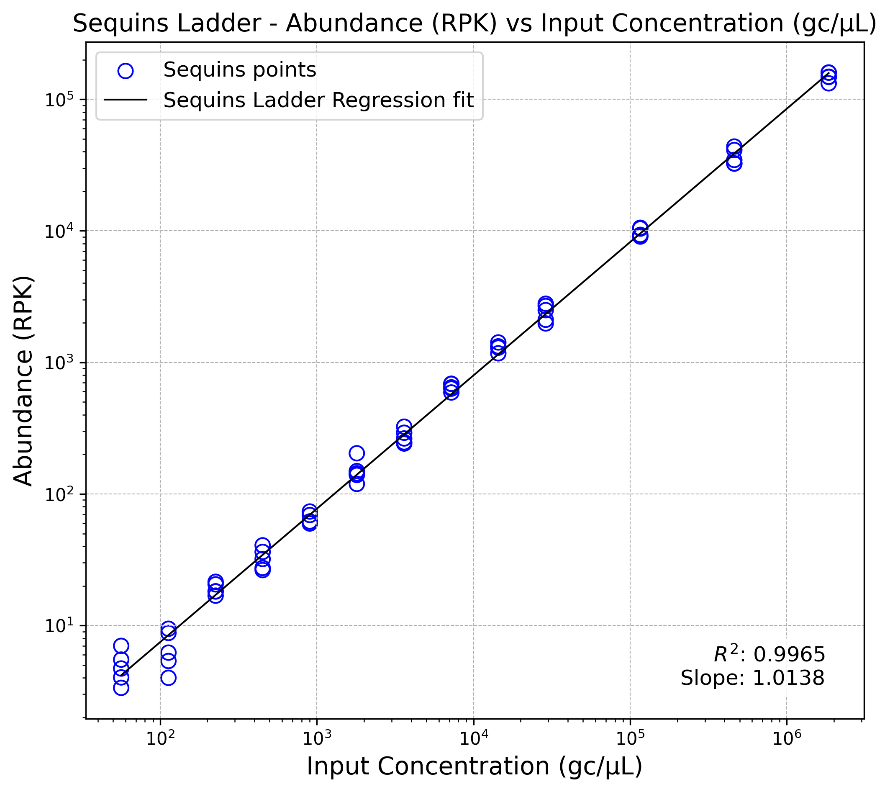
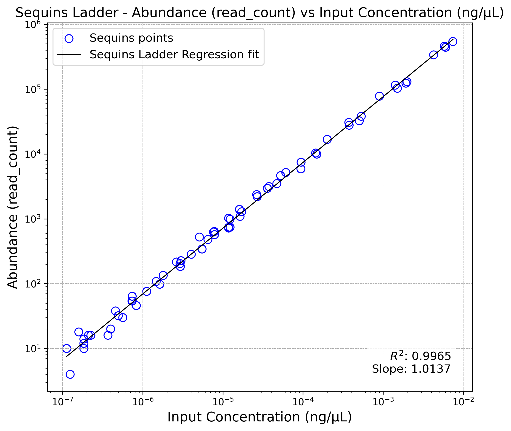

# Sequins Metagenomics Core Control Set Tutorial: Taxonomic classification for unknown targets

This is an example workflow for processing short-read metagenomics
sequencing data that have had the Sequins Metagenomics Core Control Set
spiked in. It highlights the places where Sequins specific steps must be
taken, and it is not intended as an example of a production workflow.
You should adapt each step to your own needs.

## Obtain the tutorial resources

The necessary files to run this tutorial are available via request
through the Sequins website. This includes the Sequins resource bundle,
example sequencing data and optionally a custom Kraken2 database with
Sequins included.

### Sequins resource bundle

The provided user bundle contains the following reference files:

- **metasequin_sequences.fa**  
  A standard multi-FASTA file containing individual synthetic
  metagenomic sequences, each represented as a separate FASTA entry.

- **metasequin_decoy.fa**  
  A concatenated version of the same sequences from
  **metasequin_sequences.fa** but merged into a single
  pseudochromosome-style FASTA entry, with individual sequences
  separated by a stretch of N bases. This format facilitates
  compatibility with alignment tools that require a linear reference and
  is designed to be used in conjunction with the accompanying BED file.

- **metasequin_regions.bed**  
  Provides the precise coordinates demarcating the boundaries of each
  individual sequin within **metasequin_decoy.fa**.

- **metasequin_abundances.csv**  
  The `abundance` column represents the relative molar proportion of
  each sequin in the mixture — i.e. how much of each sequin was included
  in relation to the others. Once you know the total amount of sequins
  spiked in (e.g. 1 ng), you can use these values to calculate the
  expected mass of each individual sequin. In other words, the abundance
  value does not represent an absolute unit like ng or copies/µL, but
  rather a proportional value to guide normalisation or expected
  abundance calculations. The `length` field is in base pairs (bp).

### Tutorial example data

We provide example data derived from short-read sequencing of a dog’s
microbiome, subset to reduce file size for testing with the workflow.The
files for running the tutorial include:

- **meta_taxonomy_tutorial_data_v1_R1.fastq.gz,
  meta_taxonomy_tutorial_data_v1_R2.fastq.gz**  
  Raw FASTQ files for the example sample.

- **metasequin_abundances_example.csv**  
  A metasequins abundances file with pre-computed ng/µL and copies/µL
  values for each Sequin in the sample.

- **functions.py**  
  Python helper functions for normalising quantified read counts,
  plotting Sequins ladders, and calculating limit of
  detection/quantification.

Intermediary files from each analysis stage are included in the
**intermediatory_files/** subdirectory to allow continuation of the
tutorial if any issues arise (e.g. tool installation or runtime errors).
These include:

- FASTQ files after quality processing, plus associated reports.  
- Kraken2 output files.
- Bracken output files.
- Outputs from the downstream python analysis of the quantified Sequins.

### Tutorial scripts

Helper functions for the downstream analysis of Sequins and creation of
a custom Kraken2 database that includes Sequins are provided in this 
repository at [`metagenomics/scripts/meta_taxonomic_classification_tutorial/`](https://github.com/sequinsbio/tutorials/blob/main/metagenomics/scripts/meta_taxonomic_classification_tutorial/).

### Custom taxonomic database

Taxonomic classification methods for metagenomics NGS data such as
Kraken2 typically require a taxonomy database of some form to compare
sequencing reads or assembled contigs against. To have a fully
integrated analysis of Sequins and the sample data, Sequins will need to
be integrated into the database, and we provide instructions on creation
of a custom Sequins database for Kraken2 at the end of this tutorial
(See *Creating a custom taxonomic database*), although the process may
differ for other tools.

As creating a custom Kraken2 database is highly resource-intensive, we
recommend downloading the pre-built Sequins database. Please be aware
that the database is large (92 GB uncompressed), and you will need
sufficient disk space to store it. This database is built using the
Metagenomics Core Control Set Sequins sequence and taxonomy information,
along with the NCBI archaea, bacteria, plasmid, UniVec Core, viral and
human databases, and is ready to use for taxonomic classification and
abundance estimation:

## Prepare your environment

### Option 1: Self-serve comprehensive

We provide a Docker container that has all dependencies pre-installed,
this is the recommended way to run this tutorial. You can download the
latest version of the image with:

``` sh
docker pull ghcr.io/sequinsbio/meta_tutorial:1.0.0
```

> **NOTE:** The Docker container only supports x86_64 architectures. If
> you’re running this tutorial on an ARM64 architecture (e.g., Apple
> Silicon), you should set the `DOCKER_DEFAULT_PLATFORM` environment
> variable to `linux/amd64` before running any Docker commands. This
> ensures that the container runs in an x86_64 emulation mode, which is
> necessary for compatibility with the tools included in the container.
>
> ``` sh
> export DOCKER_DEFAULT_PLATFORM=linux/amd64
> ```
>
> Alternatively, you can add the option `--platform linux/amd64` to
> every docker command.

> **NOTE:** If using a docker container on a local machine, you may need
> to increase the memory limit for the container to ensure it has
> sufficient resources to run Kraken2.

### Option 2: Independent tools

Alternatively, if you are unable to run Docker or would prefer to run
the tools natively, you can install each dependency locally.

In this example workflow we use a number of popular bioinformatics tools
that need to be installed. However, users should feel free to use
alternative software tools and/or versions to suit their needs.

- Fastp (<https://github.com/OpenGene/fastp>)
- Kraken2 (<https://github.com/DerrickWood/kraken2/>)
- Bracken (<https://github.com/jenniferlu717/Bracken>)
- Python (<https://github.com/python/cpython>)
  - NumPy (<https://github.com/numpy/numpy>)
  - Pandas (<https://github.com/pandas-dev/pandas>)
  - Seaborn (<https://github.com/seaborn/seaborn>)
  - StatsModels (<https://github.com/statsmodels/statsmodels>)
  - MatPlotLib (<https://github.com/matplotlib/matplotlib>)
  - BioPython (for database building)
    (<https://github.com/biopython/biopython>)

## Running the workflow

The following steps will walk you through a basic workflow for
performing taxonomic assignment and abundance quantification from
shotgun metagenomic sequencing with Sequins spiked-in. You can follow
along either running inside the 1) Docker container or 2) on your local
machine. You can start the Docker container with:

``` sh
docker run -it --rm -v "$PWD":"$PWD" -w "$PWD" -u "$(id -u)":"$(id -g)" \
   ghcr.io/sequinsbio/meta_tutorial:1.0.0
```

### Perform quality control of raw sequencing data

Whether quality control and pre-processing is necessary and to what
extent is dataset-specific and as such tools and parameters should be
selected accordingly. Below is an example of adaptor/quality trimming
and filtering of raw sequencing data with fastp:

``` sh
fastp --in1 meta_taxonomy_tutorial_data_v1/meta_taxonomy_tutorial_data_v1_R1.fastq.gz \
    --in2 meta_taxonomy_tutorial_data_v1/meta_taxonomy_tutorial_data_v1_R2.fastq.gz \
    --out1 meta_taxonomy_tutorial_data_v1_R1.qc.fastq.gz \
    --out2 meta_taxonomy_tutorial_data_v1_R2.qc.fastq.gz \
    -q 20 -l 36 \
    --correction \
    --cut_tail \
    --trim_poly_x \
    --trim_poly_g \
    --json meta_taxonomy_tutorial_data_v1.fastp.json \
    --html meta_taxonomy_tutorial_data_v1.fastp.html
```

You may optionally consider removal of host DNA and/or PhiX if relevant
for the sample, however this step has been performed already for the
example data provided with this tutorial.

## Taxonomic assignment and abundance estimation

Using your custom database (`$DBNAME`) and the processed data from the
previous step, you can now perform taxonomic assignment with Kraken2:

> **NOTE:** Kraken 2 will by default load the database into
> process-local RAM, therefore requiring enough free memory to hold the
> database (primarily the hash table) in RAM. Using the –memory-mapping
> flag will avoid this, reducing RAM requirements but potentially
> slowing down classification. If using a docker container on a local
> machine, you may need to increase the memory limit for the container
> to ensure it has enough resources to run Kraken2.

``` sh
# Set path to the pre-built custom Kraken2 database
DBNAME = "path/to/sequins_custom_database"

kraken2 \
   --db "$DBNAME" \
   --threads 8 \
   --memory-mapping \
   --report-zero-counts \
   --report meta_taxonomy_tutorial_data_v1.k2report.txt \
   --minimum-hit-groups 2 \
   --paired \
   meta_taxonomy_tutorial_data_v1_R1.qc.fastq.gz \
   meta_taxonomy_tutorial_data_v1_R2.qc.fastq.gz \
   > meta_taxonomy_tutorial_data_v1.kraken2
```

The classification results from Kraken2 can then be fed into Bracken to
perform abundance estimation at the desired taxonomic level:

``` sh
bracken \
    -d "$DBNAME" \
    -r 150 \
    -i meta_taxonomy_tutorial_data_v1.k2report.txt \
    -l 'S' \
    -t 1 \
    -o meta_taxonomy_tutorial_data_v1.bracken.tsv \
    -w meta_taxonomy_tutorial_data_v1.bracken.kraken_report.txt
```

To quantify abundance of individual Sequins using the custom database
built as described above, you will need to use species level (
`-l 'S'`). If wanting to quantify abundance for the microbial species at
a different level (e.g. `-l 'P'` for Phyla level) the code below can be
run again with the `-l` parameter adjusted accordingly, and abundance
results for Sequins output from the species level analysis can be
extracted and concatenated with the microbial phyla abundance results
for further downstream analysis.

### Downstream analysis with Sequins

#### Calculating expected input of Sequins

Since the abundance value provided (e.g. 32,768 for SQN000000141) in the
`metasequin_abundances.csv` file reflects the relative abundance within
the mix of 65 sequins, this value can be used to calculate the expected
input for the linear regression.

In the example data provided with this tutorial, Sequins was spiked into
a 10 µL sample containing 37.7 ng of DNA at 1%, resulting in a total of
0.377 ng input, or 0.03427 ng/µL in the final 11 µL of spiked-in sample.
With these values we can work out the ng/µL (or total ng if preferred)
of each Sequin, $``i``$, using the following formula:

``` math
\text{ng/µL}_i =  \left( \frac{\text{abundance}_i \times \text{length in bp}_i}{\sum^n_{i=1} \text{abundance}_i \times \text{length in bp}_i} \right) \times \text{total ng/µL spiked in} 
```

For example, for Sequin SQN000000141 in this dataset, this would be:

``` math
\text{4.28E-03 ng/µL} =  \left( \frac{\text{32768} \times \text{2113 bp}}{\text{5.54E+08}} \right) \times \text{3.43e-02 ng/µL }
```

This approach ensures that each Sequin’s contribution to the total mass
reflects both its relative molar abundance and its sequence length. To
calculate copies/µL from the ng/µL values calculated above you can use
the following formula:

``` math
\text{copies/µL}_i =  \frac{ \text{ng/µL}_i\times 10^{-9} \times 6.022 \times 10^{23} }{ \text{length in bp}_i \times 660 }
```

For the example data provided with this tutorial the calculations for
ng/µL and copies/µL have been performed for you and provided in the
`metasequins_abundances_example.csv` file.

#### Generating Sequins Ladder

We can evaluate sequencing performance using a log-log linear regression
between the log-transformed observed Sequin abundances and the
log-transformed expected input values calculated above. 

After downloading [`functions.py`](https://github.com/sequinsbio/tutorials/blob/main/metagenomics/scripts/meta_taxonomic_classification_tutorial/functions.py) to
your `meta_taxonomy_tutorial_data_v1/` directory, launch Python:

``` sh
python
```

Then run through the following commands to produce a plot of the
metasequins ladder comparing quantified abundance in Reads per Kilobase
(RPK) against input copies/µL for all metasequins:

``` python
import pandas as pd
from meta_taxonomy_tutorial_data_v1.functions import plot_sequins_ladder, limits_calculation

# Load expected Sequin input concentrations and lengths
input_ref = pd.read_csv('meta_taxonomy_tutorial_data_v1/metasequin_abundances_example.csv')
input_ref = input_ref.rename(columns={'sequin_id':'name'})

# Load quantified abundances from sequencing data
quant_df = pd.read_csv('meta_taxonomy_tutorial_data_v1.bracken.tsv', sep='\t')

# Filter to keep only Sequin records (names starting with 'SQN')
subset_df = quant_df[quant_df['name'].str.startswith('SQN')].copy()

# Merge Sequin quantification data with known input concentrations
sqn_df = pd.merge(subset_df, input_ref, on=['name'], how='left')

# Calculate Reads per kilobase (read counts normalised for genome length)
sqn_df['RPK'] = sqn_df['new_est_reads'] / (sqn_df['length'] / 1000)

# Generate log-log linear regression plot of the Sequins ladder
gcul_model = plot_sequins_ladder(
    sqn_df,
    'gcul',
    'RPK', 
    x_label='Input Concentration (copies/µL)',
    y_label=None, 
    title=None,
    filename=None
)
```

<figure>


<figcaption aria-hidden="true">

Sequins ladder: RPK vs gc/µL
</figcaption>

</figure>

To generate a similar ladder for raw read counts against input ng/µL:

``` python
ngul_model = plot_sequins_ladder(
    sqn_df,
    'ngul',
    'new_est_reads', 
    x_label='Input Concentration (ng/µL)',
    y_label=None, 
    title=None,
    filename=None
)
```

<figure>


<figcaption aria-hidden="true">

Sequins ladder: Read Counts vs ng/µL
</figcaption>

</figure>

#### Evaluating Limit of Detection / Limit of Quantification

There are multiple methods for quantification of Limit of Detection
(LOD) and Limit of Quantification (LOQ) and the appropriate approach
should be selected in consideration of your experiment.

For the purpose of this tutorial we apply a simple definition of LOD as
the lowest individual concentration point in the Sequins ladder at which
all Sequins are detected, and define LOQ as the lowest individual
concentration point in the Sequins ladder at which all Sequins are
detected and at which the Coefficient of Variation (CV) is ≤ 35% for
back calculated concentrations, in line with general guidelines for qPCR
[(Kubista et
al. 2017)](https://www.sciencedirect.com/science/article/pii/S2214753516300286?via%3Dihub#sec0020).

In Python we can run:

``` python
loq, lod, results = limits_calculation(
    gcul_model, sqn_df,
    x_col='gcul',
    y_col='RPK',
    cv_threshold=35.0
)

results.to_csv('limit_calculation_summary.csv')

print(f"LoD = {lod:.3e}")
print(f"LoQ = {loq:.3e}")
```

Which returns both our LoD and LoQ for this sample as 5.640e+01 or 56.4
copies/µL, and a summary of the results at each point in the sequins
ladder:

LoD = 5.640e+01
LoQ = 5.640e+01

| known_input_concentration | all_detected | mean_backcalc | std_backcalc | cv_percent |
|---------------------------|--------------|---------------|--------------|------------|
| 5.640e+01                 | True         | 6.231e+01     | 1.460e+01    | 23.43      |
| 1.130e+02                 | True         | 9.342e+01     | 3.118e+01    | 33.38      |
| 2.260e+02                 | True         | 2.530e+02     | 3.090e+01    | 12.21      |
| 4.510e+02                 | True         | 4.301e+02     | 7.939e+01    | 18.46      |
| 9.020e+02                 | True         | 8.598e+02     | 7.933e+01    | 9.23       |
| 1.800e+03                 | True         | 1.858e+03     | 1.884e+02    | 10.14      |
| 3.610e+03                 | True         | 3.543e+03     | 4.343e+02    | 12.26      |
| 7.220e+03                 | True         | 8.246e+03     | 5.087e+02    | 6.17       |
| 1.440e+04                 | True         | 1.637e+04     | 1.092e+03    | 6.67       |
| 2.890e+04                 | True         | 3.001e+04     | 4.330e+03    | 14.43      |
| 1.160e+05                 | True         | 1.175e+05     | 8.721e+03    | 7.42       |
| 4.620e+05                 | True         | 4.368e+05     | 6.071e+04    | 13.90      |
| 1.850e+06                 | True         | 1.727e+06     | 1.282e+05    | 7.42       |

Sequins abundance values and the Sequins log-log model calculated with
this tutorial can be used for further downstream analyses, such as
normalisation of microbial species abundances to Sequins and comparison
of microbial species abundances between samples. Please refer to the
[Sequins Publications Guide](https://sequins.bio/publications) for
examples of applications of Sequins in analysis of metagenomics data.

# Creating a custom taxonomic database

> **NOTE:** Creating a custom Kraken2 database is highly
> resource-intensive, requiring significant disk space and computational
> memory. Ensure you have sufficient storage and processing power
> available before proceeding. If you are using a Docker container, you
> may need to increase the memory limit for the container to ensure it
> has enough resources.

A Kraken2 database is a directory containing at least 3 files:

- `hash.k2d`: Contains the minimizer to taxon mappings
- `opts.k2d`: Contains information about the options used to build the
  database
- `taxo.k2d`: Contains taxonomy information used to build the database

To begin, download taxonomy data into `$DBNAME/taxonomy/`:

``` sh
DBNAME="sequins_custom_database"
```

``` sh
kraken2-build --download-taxonomy --db "$DBNAME"
```

You will need to modify the files `names.dmp` and `nodes.dmp` to be
Sequin aware. 

Download the [`update_taxonomy.py`](https://github.com/sequinsbio/tutorials/blob/main/metagenomics/scripts/meta_taxonomic_classification_tutorial/update_taxonomy.py) script provided in this repository at 
`metagenomics/scripts/meta_taxonomic_classification_tutorial/`.

Then run the `update_taxonomy.py` script to add Sequin taxonomy:

``` sh
python3 update_taxonomy.py \
    --nodes $DBNAME/taxonomy/nodes.dmp \
    --names $DBNAME/taxonomy/names.dmp \
    --abundances metagenomics_core_control_set_v2/metasequin_abundances.csv
```

Where `metasequin_abundances.csv` is the abundance file provided as part
of the Sequins resource bundle. This will create a new `nodes.dmp` and
`names.dmp` in the current directory.

You then need to replace the original files with the new ones (we
recommend you make a backup of the originals):

``` sh
cp -a $DBNAME "${DBNAME}.backup"
mv nodes.dmp names.dmp $DBNAME/taxonomy
```

Next you will need to modify the Sequin FASTA file to add taxonomy IDs
to each record. 

Download the [`add_taxid.py`](https://github.com/sequinsbio/tutorials/blob/main/metagenomics/scripts/meta_taxonomic_classification_tutorial/add_taxid.py) script provided in this repository at 
`metagenomics/scripts/meta_taxonomic_classification_tutorial/`.

The script uses BioPython, so create a virtual env if
you don’t already have this installed:

``` sh
python3 -m venv venv
source ./venv/bin/activate
python3 -m pip install biopython
```

Then run the `add_taxid.py` script to add the taxonomy IDs passing the
`names.dmp` you produced in the previous step:

``` sh
python3 add_taxid.py \
    --names $DBNAME/taxonomy/names.dmp \
    --fasta metagenomics_core_control_set_v2/metasequin_sequences.fa \
    >metasequin_sequences_with_taxid.fa
```

Where `metasequin_sequences.fa` is the FASTA file provided as part of
the Sequins resource bundle.

You can optionally download any other additional libraries of relevance
for your classification, such as archaea, bacteria, human, etc. using
`--download-library` (refer to the Kraken2 manual for details on
libraries). Sequins can be added to the Kraken2 database as a custom
library:

``` sh
kraken2-build --download-library archaea --db "$DBNAME"
kraken2-build --add-to-library metasequin_sequences_with_taxid.fa --db "$DBNAME"
```

You can now build your Kraken2 database in the usual way (refer to the
Kraken2 manual for full instructions on building custom databases):

``` sh
kraken2-build --build --threads 8 --db "$DBNAME"
```

To use Bracken for abundance estimation from the Kraken2 results, you
will need to generate a Bracken database file (refer to the Bracken
manual for full instructions):

``` sh
bracken-build -d "$DBNAME" -t 8 -k 35 -l 150
```

Where `-k` is the k-mer length and `-l` is the read length.

Your custom database can now be used for taxonomic classification and
abundance estimation with Kraken2 and Bracken, for both Sequins and the
microbial species from the libraries you chose to download, following
the steps in the above tutorial.
